VMware Advanced Customer Engagements (ACE) Team   
Authored by Riaz Mohamed & Raghu Pemmaraju

May 2020

Table of Contents 
=================

[Introduction](#introduction)

[Usecase](#use-case)

[Traffic flows](#traffic-flows)

[Assumptions](#assumptions)

[K8s Resources](#k8s-resources)

[Pod Definition](#pod-definition)

[Deployments And Services](#deployments-and-services)

[K8s Resource Deployments](#k8s-resource-deployments)

[K8 Deployments](#k8-deployments)

[Current Traffic Flow](#current-traffic-flow)

[Configure Micro Segmentation with NSX-T](#configure-micro-segmentation-with-nsx-t)

[Test Traffic Flow](#test-traffic-flow)

Introduction
============

In this document, we provide an overview on NSXT micro segmentation to
control traffic flows between services .

This document simulates a typical DMZ cluster where traffic flow is
controlled. Any ingress into the cluster is serviced by a pod running in
namespace x1 (typically this would be an ingress controller like
nginx/contour)

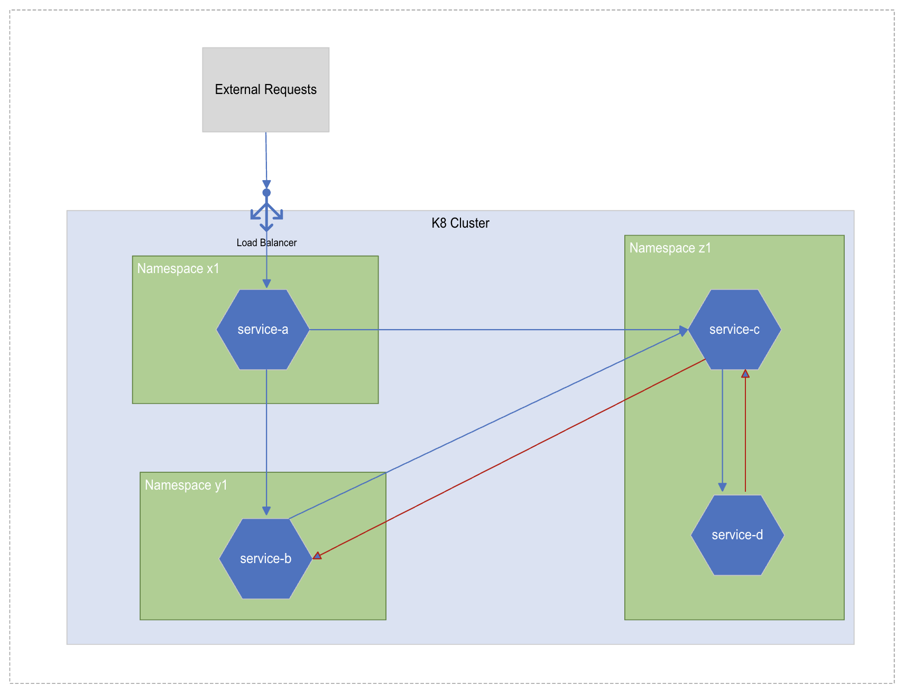  

Usecase 
========

The k8s cluster has three namespaces (namespace x1, y1 and z1). All
ingress into the cluster is restricted to namespace x1 and pod
service-a.

Namespace y1 runs a pod service-b and namespace z1 runs pods service-c
and service-d.

Traffic flows
-------------

All ingress traffic into the cluster can only be serviced by service-a
on namespace x1

Service-b allows traffic from service-a

Service-b denies traffic from service-c

Service-c allows traffic from service-a and service-b

Service-d allows traffic from only service-c

Service-c denies traffic from service-d

Assumptions
-----------

K8s cluster exists

K8s Resources
=============

Pod Definition
--------------

We will be using a pod definition with 2 containers

-   nginx (to service web requests)

-   busybox with curl (container to test service to service traffic)

Deployments And Services
------------------------

Service-a , service-b, service-c and service-d are identical and run the
above pod definition on their respective namespaces, they run two
replicas and are exposed as services srv-service-a, srv-service-b,
srv-service-c, srv-service-d

K8s Resource Deployments
========================

This section goes through the steps to set up the K8 environment with
the deployments in their respective namespaces. At the end of the setup
a test will be performed to establish that the there is traffic flow
between the different services deployed

K8 Deployments
--------------

1. **Login to k8s cluster**

> pks login -a \<pks-api\> -u \<pksuser\> -p \<pks-password\> -k
>
> Eg.
>
> pks login -a pks.corp.local -u pksadmin -p VMware1! -k

2. **Get Kubeconfig**

> pks get-kubeconfig \<cluster-name\> -a \<pks-api\> -u \<pksuser\> -p
> \<pks-password\> -k
>
> Eg.
>
> pks get-kubeconfig ci-cluster -a pks.corp.local -u pksadmin -p
> VMware1! -k

3. **Change context**

> kubectl config use-context ci-cluster

4. **Create Namespace x1, y1, z1**

> kubectl create ns x1
>
> kubectl create ns y1
>
> kubectl create ns z1
>
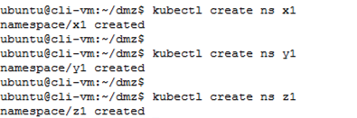

5. **Check if namespace is created**

> kubectl ge ns
>

6. **Create Deployments & Services**

Download the yaml file or copy contents to a local file Eg. micro.yaml . This file declares the K8 resources required . Create the necessary
resources in their respective namespaces

[https://github.com/riazvm/nsxtk8smicrosegmentation/blob/master/yaml/micro.yaml](https://github.com/riazvm/nsxtk8smicrosegmentation/blob/master/yaml/micro.yaml)
>
> kubectl apply -f micro.yaml
>
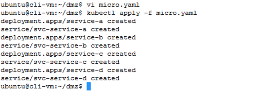

7. **Check services and pods created in each namespace**

> kubectl get all -n x1
>
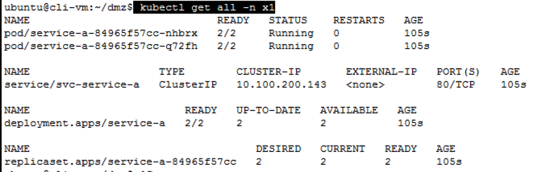
>
> kubectl get all -n y1
>
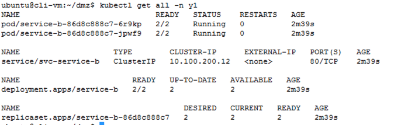
>
> kubectl get all -n z1
>
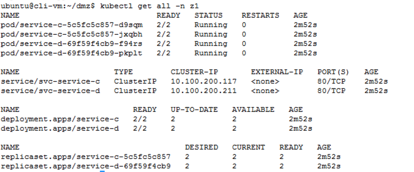

8. **Expose service-a as a load-balancer service**

> kubectl expose deployment service-a --name=service-a-lb --port=80 --target-port=8080 --type=LoadBalancer --namespace=x1

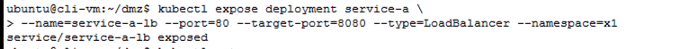

9.  **Check the external URL/IP address assigned to the service (make note of the first IP addres under External-IP).**

> kubectl get svc -n x1
>
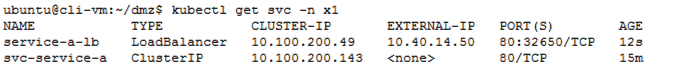

Current Traffic Flow
--------------------

**Traffic flow from external network to k8 cluster**.

Open a browser and browse to the external ip from the previous step

service-a can be reached from the external network through the load balancer which is created in NSX-T

service-b, service-c and service-d are not exposed and hence are not reachable from the external network.

**Traffic flow between pods**

Use the busy-box container within service-a pod and use curl to check for responses between service.

Source Service -- service-a (namespace x1)

Target Service -- service-b (namespace y1)

1. **Get pods running on namespace x1**

> kubectl get po -n x1

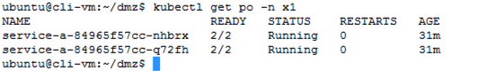

2. **Get service name for service-b running on namespace y1**

> kubectl get svc -n y1\
> \
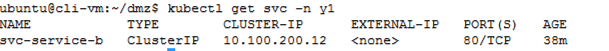

3. **Exec into the busybox container running on a service-a pod**

> kubectl exec -n \<namespace\> \<podname\> -it -c busybox \-- /bin/sh
>
> Eg
>
> kubectl exec -n x1 service-a-84965f57cc-nhbrx -it -c busybox \--
> /bin/sh
>
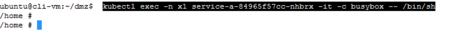

4. **Use curl to reach service-b in namespace y1**

> curl <http://svc-service-b.y1>
>
NOTE: the service name is prepended by svc in this case, this is defined in the yaml we used to create the K8 resources. The service
name is also appended by the namespace.

5. **This results in a successful response**

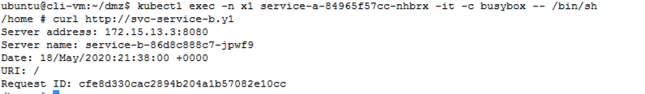

6. **Use the curl command to check the service response of service-d in namespace z1**

curl <http://svc-service-d.z1>

This should be successful as well

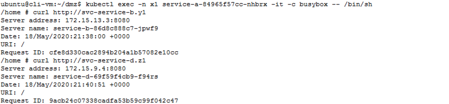

At this point all services should be able to communicate to each other. The only traffic allowed from outside the cluster is to service-a via
the loadbalancer.

Configure Micro Segmentation with NSX-T
=======================================

This section goes through the configuration of NSX-T DFW rules that are
required to allow, restrict or drop pod to pod traffic.

1. **Check labels on the pods**

> kubectl get pod \--show-labels -n x1

Check the labels on the pods in namespace y1 and z1 as well

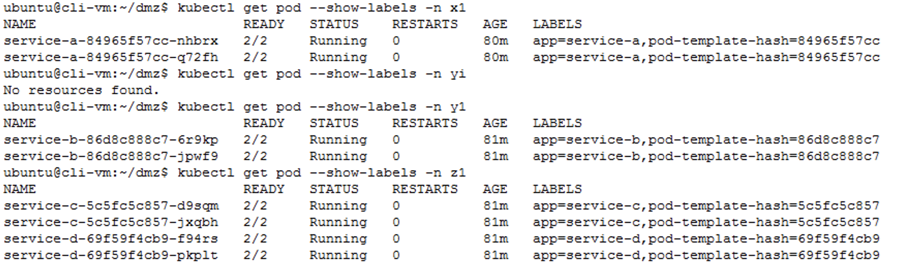

2. **Check tags for pods in NSXT**

Login to NSXT and Navigate to Advanced Networking & Security Switching Ports

The pods service-a , service-b, service-c and service-d would have a logical port assigned to them

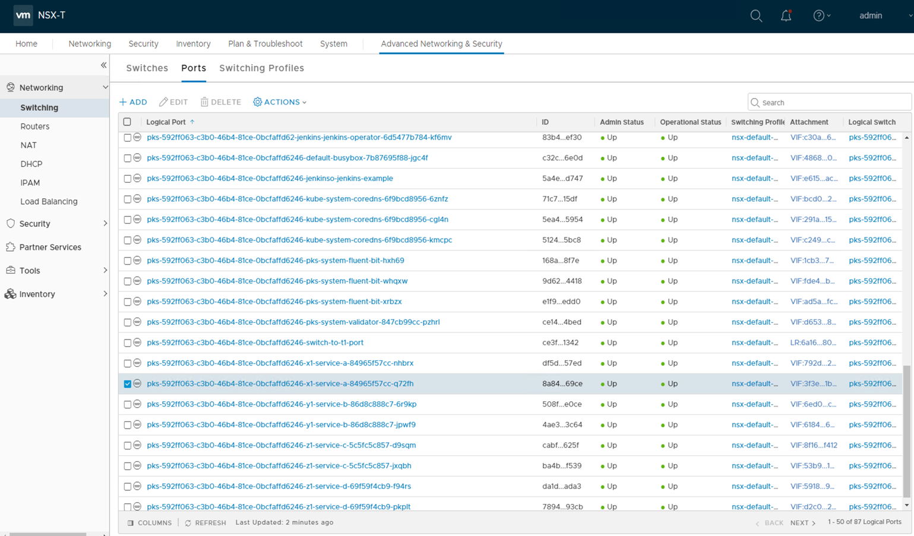

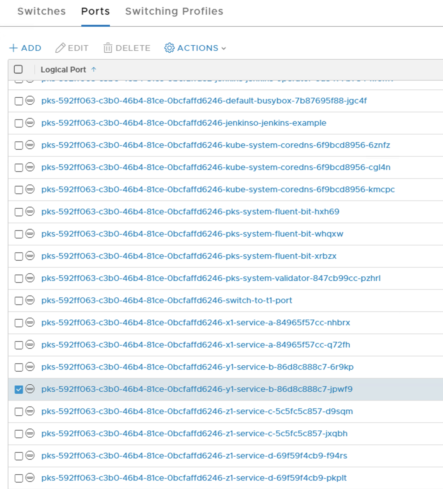

Click on one of the Logical ports associated with the services we are working with and notice that the tags on NSXT is the labels defined
for the pods in K8s.

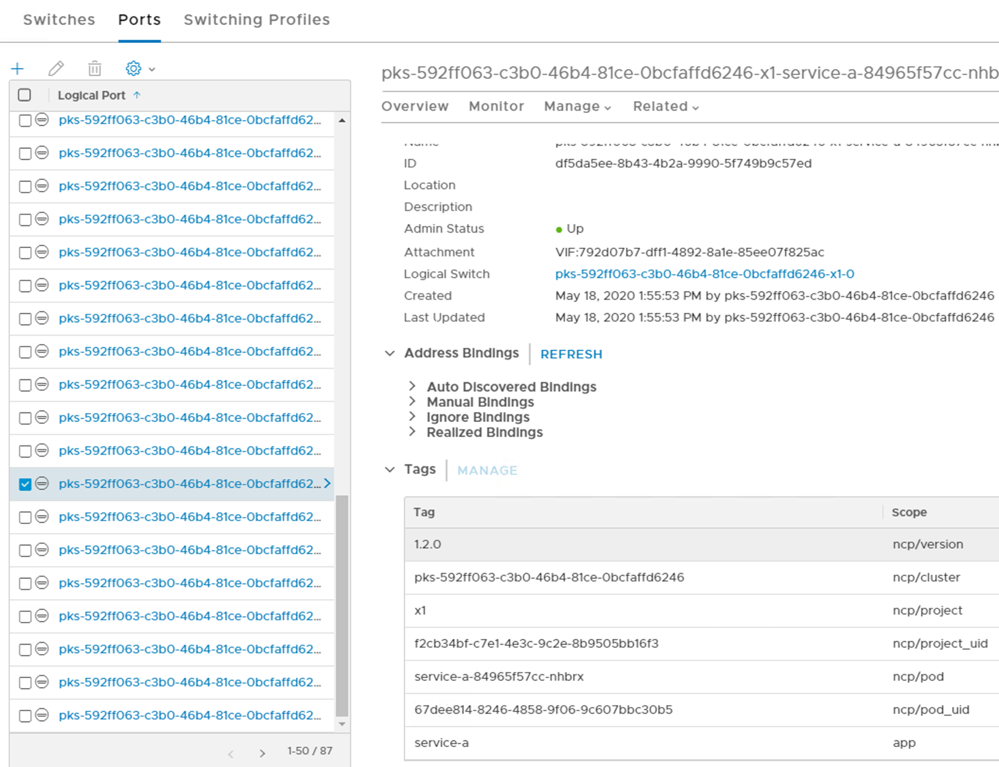

3.  **Create NSX-T NSGroup (NSX-T Security Group)**

Login to NSXT and Navigate to Advanced Networking & Security Inventory Groups

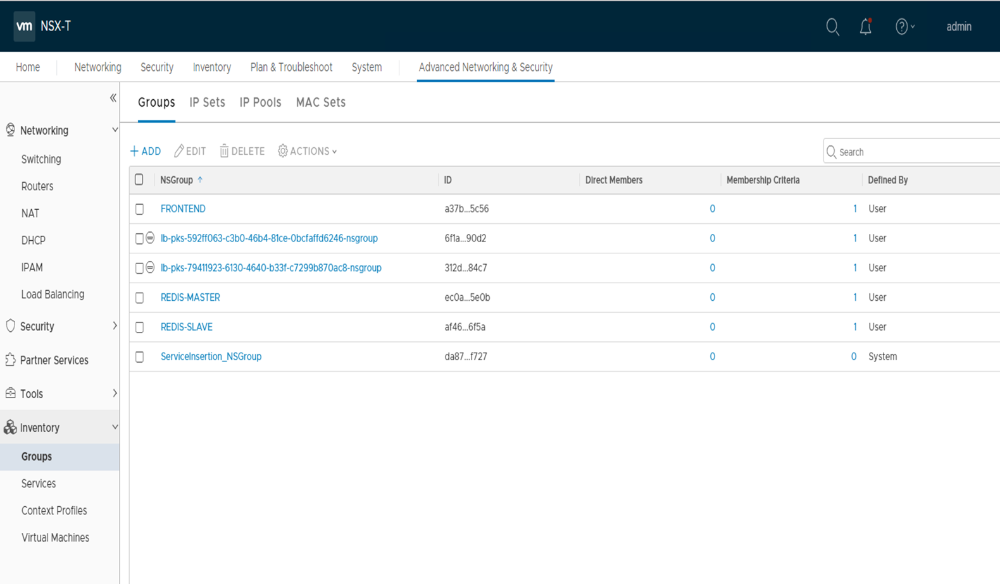

***Create a new NSGroup by clicking on ADD***
>
> Create an NSGroup for service-a
>
> NSGroup name -- nsg-service-a
>

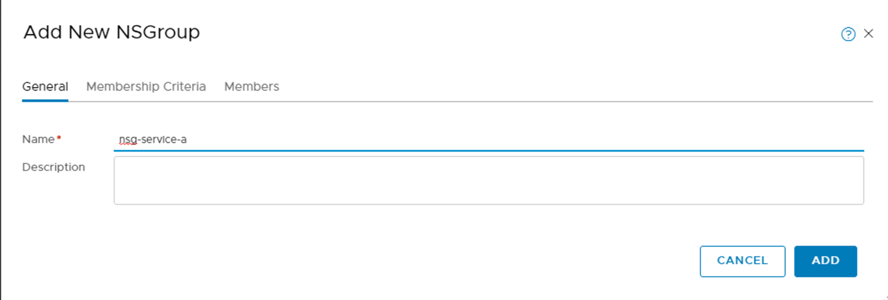
>
> Click on Membership Critera
> And add the following criteria
>
> Logical Port > Tag > Equals > service-a > Scope > equals > app
>
> Note this are the values of the tag retrieved in step 2.

Repeat the same to create NSGroups for service-b, service-c and service-d

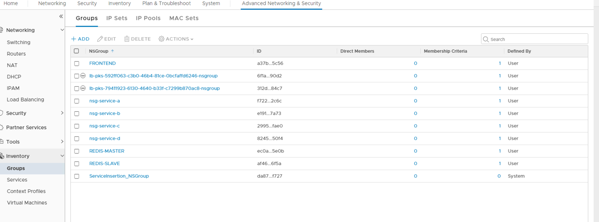

4.  **Check for pool members**

Click on the newly created groups and select Members , check IP addresses

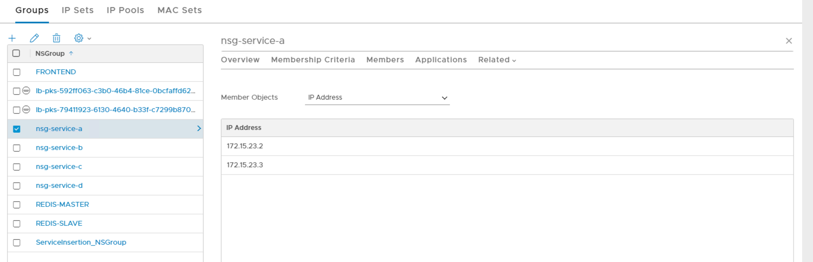

Run the following kubectl command from the terminal to verify that the ip-address match the pods ip addresses
>
> kubectl get po -n x1 -o wide

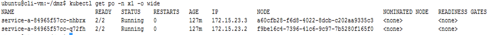

Repeat the same for the other NSGroups created

5.  **Create DFW rules**

Login to NSXT and navigate to Advanced Networking & Security Security Distributed Firewall

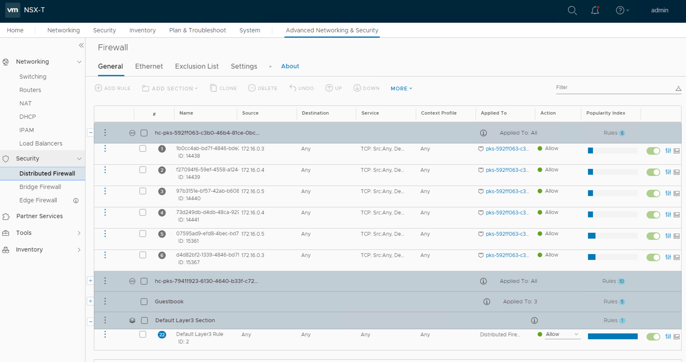

Select the first section listed and navigate to ADD SECTION Add Section Above

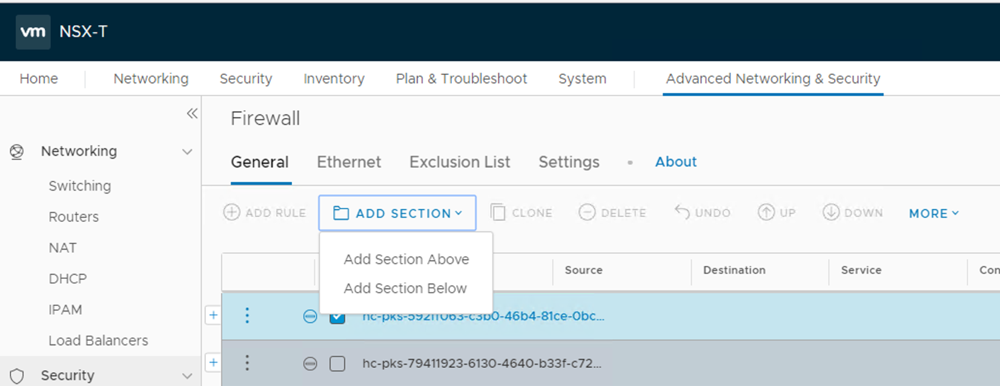

> Section Name -- PtoPDFW-MicroSegmentation
> Object Type -- NSGroup
> Select -- nsg-service-b, nsg-service-c and nsg-service-d
> 
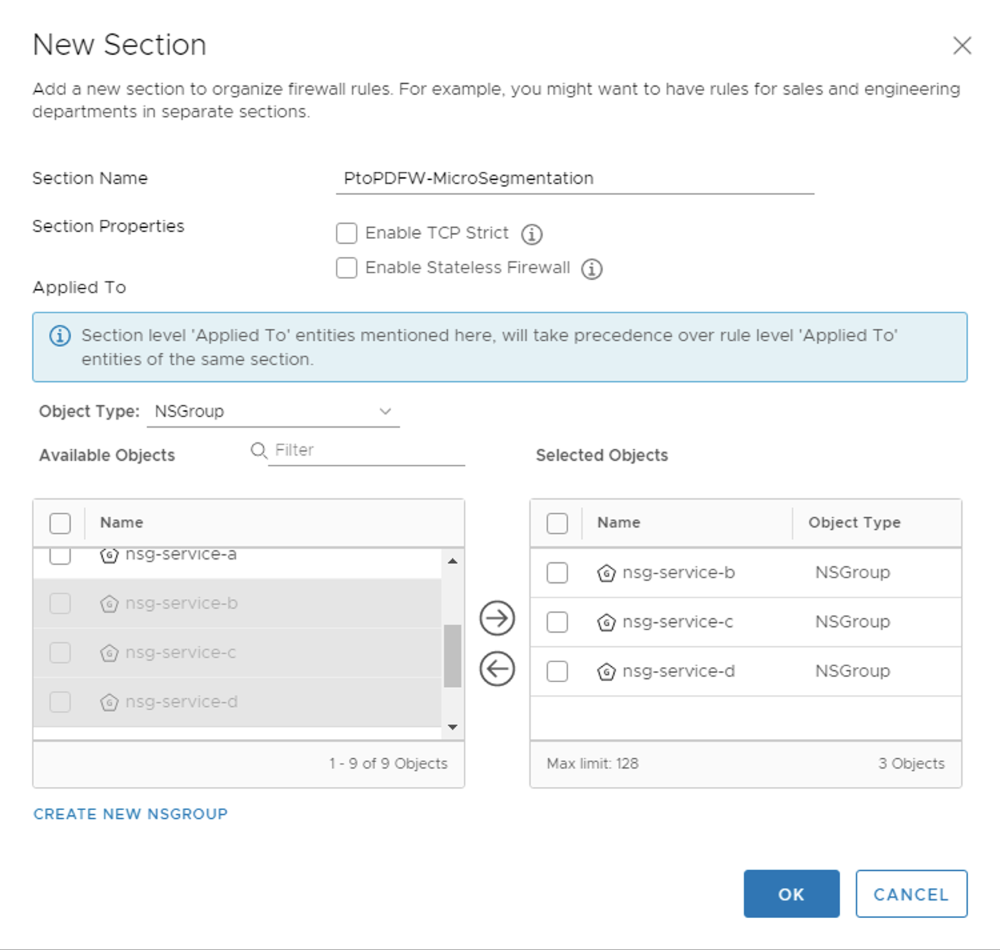

Select the newly created PtoPDFW-MicroSegmentation segment and click on Add rule

Rule 5: Denies all Traffic to nsg-service-a, nsg-service-b and nsg-service-c

> ID : DenyAll  
> Source : Any  
> Destination: Any  
> Service: Any  
> ContextProfile: Any  
> Action : Reject 
>
Rule 4: Allow service-a to service-b traffic
>
> ID : service-aToservice-b  
> Source : nsg-service-a  
> Destination: nsg-service-b  
> Service: Any  
> ContextProfile: Any  
> Action : Allow
>
To select the Source click on the icon next to the source filed and click on Edit Rule Source

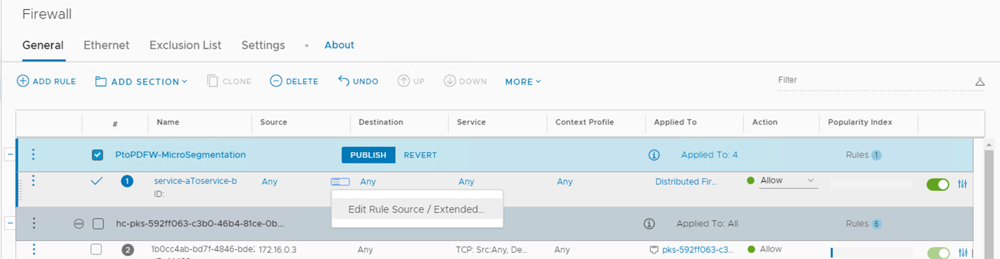

Select Object Type as NSGroup

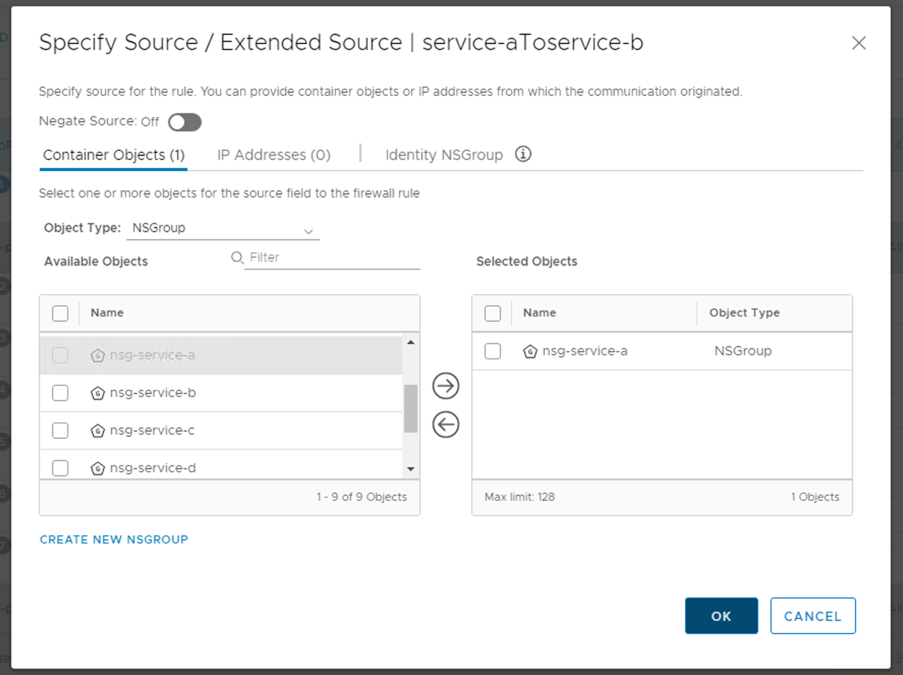

Similarly select nsg-service-b for destination.

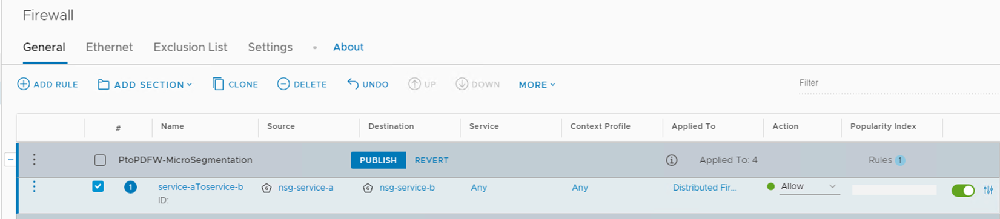

Rule 3: Allow service-a to service-c traffic

> ID : service-aToservice-c  
> Source : nsg-service-a  
> Destination: nsg-service-c  
> Service: Any  
> ContextProfile: Any  
> Action : Allow

Rule 2: Allow service-b to service-c traffic

> ID : service-bToservice-c  
> Source : nsg-service-b  
> Destination: nsg-service-c  
> Service: Any  
> ContextProfile: Any  
> Action : Allow

Rule 1: Allow service-c to service-d traffic

> ID : service-cToservice-d  
> Source : nsg-service-c  
> Destination: nsg-service-d  
> Service: Any  
> ContextProfile: Any  
> Action : Allow  

Select PtoPDFW-Microsegmentation and click on Publish

Test Traffic Flow
=================

**Traffic flow from external network to k8 cluster**.

Open a browser and browse to the external ip from the previous step

service-a can be reached from the external network through the load balancer which is created in NSX-T

service-b, service-c and service-d are not exposed and hence are not reachable from the external network.

**Traffic flow between pods**

We will be using the busy-box container within service-a pod and use curl to check for responses between service.

 -------------------------------------------------------------
| **Source Pod**   |  **Destination Pod** |  **Test Result**  | 
| ---------------- | ---------------------| ------------------| 
| service-a        | service-b            | Success           | 
| service-a        | service-c            | Success           | 
| service-a        | service-d            | Fail              | 
| service-b        | service-c            | Success           | 
| service-b        | service-d            | Fail              | 
| service-c        | service-d            | Success           | 
| service-c        | service-b            | Fail              | 
| service-d        | service-c            | Fail              | 
| service-d        | service-b            | Fail              | 

1. **Get pods running on namespace x1**

> kubectl get po -n x1

2. **Get service name for service-b running on namespace y1**

> kubectl get svc -n y1

3.  **Exec into the busybox container running on a service-a pod**

> kubectl exec -n \<namespace\> \<podname\> -it -c busybox -- /bin/sh
>
> Eg
>
> kubectl exec -n x1 service-a-84965f57cc-nhbrx -it -c busybox -- /bin/sh

 Use curl to reach service-b in namespace y1
>
> curl <http://svc-service-b.y1>
>
NOTE: the service name is prepended by svc in this case, this is defined in the yaml we used to create the K8 resources. The service
name is also appended by the namespace.

4.  **This results in a successful response**

5. **Use the curl command to check the service response of service-c in namespace z1**

> curl <http://svc-service-c.z1>

This should be successful as well

6. **Use the curl command to check the service response of service-d in namespace z1**

> curl <http://svc-service-d.z1>

This would fail

Exec into each pod and check connectivity between pods.
